# MT Modulis — Gamybos kokybės valdymo sistema

**UAB "ELGA"** | PHP 8.3 + PostgreSQL 16 | Autorius: Tomas Viržintas

## Apžvalga

MT Modulis yra žiniatinklio pagrindu veikianti gamybos kokybės valdymo sistema,
skirta modulinių transformatorių ir kitų gaminių gamybos procesų kokybės kontrolei.

**Technologijos:** PHP 8.3 · PostgreSQL 16 · PDO · mPDF · Resend API  
**Serveris:** PHP integruotas serveris  
**Produkcinė sistema:** https://nkokybe.elga.tech

## Pagrindinės funkcijos

- Užsakymų ir gaminių valdymas
- Funkcinių ir dielektrinių bandymų registravimas
- Komponentų sekimas ir paso generavimas (PDF)
- Pretenzijų valdymas su el. pašto istorija
- Matavimo prietaisų priežiūra
- Kokybės statistika ir PDF ataskaitos
- Vartotojų valdymas (rolės: `administratorius`, `vartotojas`, `skaitytojas`)

## Duomenų bazės schema (PostgreSQL 16)

> Diagrama sugeneruota automatiškai iš gyvos PostgreSQL duomenų bazės  
> Data: 2026-05-27 · Lentelių: 23

```mermaid
erDiagram
    aktyvus_vartotojai {
        int id PK
        int vartotojas_id
        varchar session_id
        varchar vardas
        varchar pavarde
        timestamp prisijungimo_laikas
        timestamp paskutine_veikla
        varchar ip_adresas
        varchar naršykle
    }
    bandymai_prietaisai {
        int id PK
        int gaminys_id
        varchar prietaiso_tipas
        varchar prietaiso_nr
        date patikra_data
        date galioja_iki
        varchar sertifikato_nr
    }
    dielektriniai_bandymai {
        int id
        int gaminys_id
        int eiles_nr
        text aprasymas
        varchar itampa
        varchar schema1
        varchar schema2
        varchar schema3
        varchar schema4
        varchar schema5
        varchar schema6
        text isvada
        varchar tipas
        text grandines_pavadinimas
        varchar grandines_itampa
        varchar bandymo_schema
        varchar bandymo_itampa_kv
        varchar bandymo_trukme
    }
    funkciniai_bandymai {
        int id
        int gaminio_id
        int eil_nr
        text reikalavimas
        text isvada
        text defektas
        varchar darba_atliko
        varchar irase_vartotojas
        bytea defekto_nuotrauka
        varchar defekto_nuotraukos_pavadinimas
        text pataisyta
        text issiusta_kam
    }
    funkciniu_sablonas {
        int id PK
        int eil_nr
        text pavadinimas
        int gaminiu_rusis_id
    }
    gaminiai {
        int id PK
        int uzsakymo_id
        varchar gaminio_numeris
        int gaminio_tipas_id
        varchar protokolo_nr
        varchar atitikmuo_kodas
        bytea mt_paso_pdf
        varchar mt_paso_failas
        bytea mt_dielektriniu_pdf
        varchar mt_dielektriniu_failas
        bytea mt_funkciniu_pdf
        varchar mt_funkciniu_failas
        text pavadinimas
        bool dielektriniai_issaugoti
    }
    gaminio_tipai {
        int id PK
        text gaminio_tipas
        text grupe
        text atitikmuo_kodas
    }
    gaminiu_rusys {
        int id PK
        text pavadinimas
    }
    imones_nustatymai {
        int id PK
        varchar pavadinimas
        text adresas
        varchar telefonas
        varchar faksas
        varchar el_pastas
        varchar internetas
        bytea logotipas
        varchar logotipo_tipas
    }
    izeminimo_tikrinimas {
        int id
        int gaminys_id
        varchar eil_nr
        varchar tasko_pavadinimas
        int matavimo_tasku_skaicius
        numeric varza_ohm
        varchar budas
        varchar bukle
    }
    komponentai {
        int id PK
        int eiles_numeris
        text gamintojo_kodas
        int kiekis
        text aprasymas
        text gamintojas
        int gaminio_id
        smallint parinkta_projektui
    }
    objektai {
        int id PK
        text pavadinimas
    }
    paso_teksto_korekcijos {
        int id PK
        int gaminio_id
        varchar field_key
        varchar lang
        text tekstas
        timestamp updated_at
    }
    pretenzijos {
        int id PK
        int uzsakymo_id
        int gaminio_id
        varchar pretenzijos_nr
        date data
        varchar tipas
        text aprasymas
        varchar statusas
        varchar prioritetas
        varchar atsakingas_asmuo
        text sprendimas
        date uzdaryta_data
        int sukure_id
        timestamp sukurta
        timestamp atnaujinta
        varchar aptikimo_vieta
        varchar gaminys_info
        varchar atsakingas_padalinys
        text siulomas_sprendimas
        varchar uzfiksavo_padalinys
        varchar uzfiksavo_asmuo
        text priezastis
        text veiksmai
        date terminas
        date gavimo_data
        date uzbaigimo_data
        varchar sukure_vardas
        varchar uzsakymo_numeris_ranka
        varchar defekto_pdf_pavadinimas
        bytea defekto_pdf_turinys
        int qt_pretenzija_id
        varchar perziuros_token
    }
    pretenzijos_email_history {
        int id PK
        int pretenzija_id
        varchar email_delegated_to
        text email_cc
        varchar email_subject
        varchar sent_by
        timestamp sent_at
        text feedback_text
        timestamp feedback_at
        varchar feedback_by
        text papildomas_komentaras
        text outgoing_text
        int parent_history_id
    }
    pretenzijos_failai {
        int id PK
        int pretenzija_id
        varchar pavadinimas
        varchar tipas
        bytea turinys
        timestamp ikelta
    }
    pretenzijos_nuotraukos {
        int id PK
        int pretenzija_id
        varchar pavadinimas
        varchar tipas
        bytea turinys
        timestamp sukurta
    }
    prietaisai {
        int id PK
        varchar vidinis_kodas
        varchar pavadinimas
        varchar gamintojas
        varchar modelis
        varchar serijos_nr
        varchar matavimo_tipas
        text matavimo_ribos
        varchar tikslumo_klase
        varchar busena
        varchar vieta
        varchar atsakingas_asmuo
        varchar kalibracijos_sertifikato_nr
        varchar kalibravimo_istaiga
        date kalibravimo_data
        date galiojimo_pabaiga
        date kita_kalibracija
        text standartas_metodika
        bytea sertifikato_pdf
        varchar sertifikato_failas
        text pastabos
        timestamp sukurta
        timestamp atnaujinta
    }
    remember_tokens {
        int id PK
        int vartotojas_id
        varchar token
        timestamp expires_at
    }
    saugikliu_ideklai {
        int id
        int gaminio_id
        varchar sekcija
        int pozicija
        varchar gabaritas
        varchar nominalas
        int pozicijos_numeris
    }
    uzsakovai {
        int id PK
        text uzsakovas
    }
    uzsakymai {
        int id PK
        varchar uzsakymo_numeris
        text sukurtas
        int kiekis
        int uzsakovas_id
        int vartotojas_id
        int objektas_id
        int gaminiu_rusis_id
        varchar imone_pavadinimas
        text imone_adresas
        varchar imone_telefonas
        varchar imone_faksas
        varchar imone_el_pastas
        varchar imone_internetas
    }
    vartotojai {
        int id PK
        varchar vardas
        varchar pavarde
        varchar el_pastas
        varchar slaptazodis
        text sukurta
        text role
        varchar login_token
        timestamp token_galiojimas
        bool patvirtintas
        int patvirtino_id
        timestamp patvirtinimo_data
        bytea parasas
        varchar parasas_tipas
        varchar pareigos
    }

    pretenzijos_email_history }o--|| pretenzijos_email_history : "parent_history_id"
    pretenzijos_email_history }o--|| pretenzijos : "pretenzija_id"
    pretenzijos_failai }o--|| pretenzijos : "pretenzija_id"
    pretenzijos_nuotraukos }o--|| pretenzijos : "pretenzija_id"
```



## Lentelių aprašas (23 lentelės)

| Lentelė | Paskirtis |
|---|---|
| `vartotojai` | Sistemos vartotojai ir rolės (administratorius, vartotojas, skaitytojas) |
| `uzsakymai` | Gamybos užsakymai |
| `uzsakovai` | Užsakovų įmonės |
| `objektai` | Statybos / montavimo objektai |
| `gaminiai` | Pagaminti gaminiai (su PDF kaip BYTEA) |
| `gaminiu_rusys` | Gaminių rūšys (MT, USN, SI-04 ir kt.) |
| `gaminio_tipai` | Gaminių tipai pagal rūšį |
| `funkciniai_bandymai` | Funkcinių bandymų rezultatai ir defektai |
| `funkciniu_sablonas` | Funkcinių reikalavimų šablonai pagal rūšį |
| `dielektriniai_bandymai` | Dielektrinių bandymų duomenys |
| `izeminimo_tikrinimas` | Įžeminimo tikrinimo rezultatai |
| `komponentai` | Gaminiuose sumontuoti komponentai |
| `saugikliu_ideklai` | Saugiklių įdėklų duomenys |
| `paso_teksto_korekcijos` | Paso teksto korekcijos |
| `pretenzijos` | Klientų pretenzijos ir defektai |
| `pretenzijos_nuotraukos` | Pretenzijų nuotraukos (BYTEA) |
| `pretenzijos_email_history` | El. pašto siuntimo istorija |
| `pretenzijos_failai` | Pretenzijų priedai (PDF, .msg) |
| `prietaisai` | Matavimo prietaisai |
| `bandymai_prietaisai` | Prietaisų kalibravimo sertifikatai |
| `imones_nustatymai` | Įmonės duomenys ir logotipas |
| `aktyvus_vartotojai` | Aktyvių sesijų stebėjimas |
| `remember_tokens` | "Prisiminti mane" autentifikacijos žetonai |

## Saugumo priemonės

- Slaptažodžiai šifruojami `password_hash()` (bcrypt)
- Visos DB užklausos — paruoštos užklausos (PDO prepared statements)
- XSS apsauga — `htmlspecialchars()` visose išvestyse
- Sesijų apsauga — `session_regenerate_id()` po prisijungimo
- CSRF apsauga — vienkarčiai žetonai formose

## Failų struktūra

```
public/          — žiniatinklio šaknis (PHP puslapiai)
public/includes/ — konfigūracija, antraštė, poraštė
public/klases/   — PHP klasės (Database, Gaminys, Emailas ir kt.)
public/MT/       — MT modulio puslapiai ir PDF generatoriai
public/css/      — stilių failai
public/js/       — JavaScript failai
docs/            — dokumentacija (nepasiekiama iš interneto)
migracija.php    — DB migracijų CLI skriptas
```
